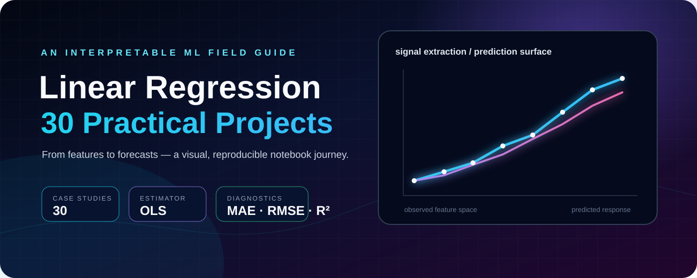

# Linear Regression 30 Practical Projects

<p align="center">
  <a href="https://colab.research.google.com/github/sgsinghashka-del/Linear-Regression-30-Practical-Projects/blob/main/Linear_Regression_30_Practical_Project.ipynb"></a>
  <a href="https://github.com/sgsinghashka-del/Linear-Regression-30-Practical-Projects/blob/main/Linear_Regression_30_Practical_Project.ipynb"></a>
  
  
  
</p>

<p align="center"></p>

<p align="center"><strong>A reproducible, notebook-based study of interpretable linear models across practical prediction scenarios.</strong></p>

## Project Highlights

<table align="center">
<tr><td>🧪 <strong>30 practical cases</strong></td><td>📈 <strong>OLS regression workflow</strong></td><td>🔍 <strong>Interpretable coefficients</strong></td></tr>
<tr><td>📊 <strong>MAE · RMSE · R²</strong></td><td>🎨 <strong>Matplotlib diagnostics</strong></td><td>▶️ <strong>Colab-ready notebook</strong></td></tr>
</table>

| Highlight | What it demonstrates |
|---|---|
| **End-to-end ML** | Data creation, feature selection, splitting, training, evaluation, and inference in one repeatable workflow. |
| **Practical transfer** | The same estimator is applied to housing, salary, academic performance, and electricity domains. |
| **Explainability first** | Coefficients, intercepts, metric values, and plots remain visible rather than hidden behind an abstraction layer. |
| **Portfolio-ready evidence** | Reproducible notebook outputs, documented assumptions, and a clear path for extending the experiments. |

## Why This Matters

### For recruiters and hiring teams

This project demonstrates more than the ability to call `LinearRegression().fit()`. It shows a disciplined modeling workflow: defining a business question, selecting meaningful predictors, separating training from evaluation, interpreting error, communicating results visually, and acknowledging limitations. Those are transferable skills for analytics, data science, and machine-learning roles.

### For academic readers and learners

The notebook is a transparent teaching artifact. Each case study makes the design matrix, target variable, estimator, metrics, and prediction behavior inspectable. It is suitable as a starting point for discussing ordinary least squares, model interpretability, experimental reproducibility, synthetic-data limitations, and extensions such as cross-validation or regularization.

### For decision-makers

A linear model provides a useful baseline because its assumptions and failure modes are easy to communicate. It can reveal directional relationships and provide a reference point before more complex models are introduced. The results here are educational demonstrations—not production forecasts or causal claims.

## Abstract

This repository presents a compact experimental portfolio for understanding ordinary least-squares linear regression through repeated practical applications. The accompanying notebook constructs small tabular datasets, selects explanatory variables, partitions observations into training and test subsets, estimates a multivariate linear model, evaluates predictive error, interprets coefficients, and produces diagnostic visualizations.

> **Scope note:** The notebook uses constructed, beginner-friendly datasets. Reported metrics demonstrate estimator behavior and workflow reproducibility; they are not evidence of performance on production or population-level data.

## Results and Methodology

### Methodology at a glance

```text
Constructed tabular data
          ↓
Define X (features) and y (target)
          ↓
80/20 train-test split · random_state=42
          ↓
Fit sklearn LinearRegression (ordinary least squares)
          ↓
Predict held-out observations
          ↓
Compute MAE, RMSE, and R²
          ↓
Interpret coefficients and visualize trends
```

The fitted model is:

\[
\hat{y} = \beta_0 + \beta_1x_1 + \beta_2x_2 + \cdots + \beta_px_p
\]

where \(\beta_0\) is the intercept and each \(\beta_i\) represents the expected target change for a one-unit change in a predictor, conditional on the remaining predictors.

### Reported held-out results

| Case study | Inputs | MAE | RMSE | R² | Example prediction |
|---|---|---:|---:|---:|---|
| House price | Area, bedrooms, bathrooms | 5.09 | 6.84 | 0.98 | ₹112.95 lakhs |
| Salary | Experience, education, age | 0.33 | 0.37 | 1.00 | ₹7.93 lakhs/year |
| Student marks | Study hours, attendance, assignments | 1.32 | 1.72 | 0.99 | 33.32 marks in shown input run |

### Reading the results

- **MAE** is the average absolute prediction error in the target’s original units.
- **RMSE** gives larger errors more influence and is useful for spotting costly misses.
- **R²** summarizes the proportion of target variance explained by the fitted model on the selected test split.
- The very strong scores are expected from small, ordered synthetic datasets; they should not be mistaken for external validity.

## Case Studies

| Case study | Predictors | Target | Main visual question |
|---|---|---|---|
| House price | Area, bedrooms, bathrooms | House price (₹ lakhs) | Does larger area track with higher price? |
| Salary | Experience, education, age | Salary (₹ lakhs/year) | How does salary trend with experience? |
| Student marks | Study hours, attendance, assignments | Marks | How do learning behaviors relate to marks? |
| Electricity consumption | Temperature, day, household size | Electricity units | How do household and environmental variables relate to usage? |

## Validity, Assumptions, and Limitations

Linear regression is most defensible when relationships are approximately linear, observations are appropriately independent, residual variance is reasonably stable, and predictors are not excessively collinear. This notebook does not establish all assumptions statistically. Important limitations include:

- manually created data rather than representative observations;
- small sample sizes and a single train-test split;
- no confidence intervals, residual tests, cross-validation, or external validation;
- possible overstatement of usefulness from high R² on structured data;
- coefficient magnitudes that should not be compared across incompatible units without context.

These limitations are useful extension points rather than hidden defects.

## Reproducibility

### Requirements

```bash
pip install pandas matplotlib scikit-learn notebook
```

### Run locally

```bash
git clone https://github.com/sgsinghashka-del/Linear-Regression-30-Practical-Projects.git
cd Linear-Regression-30-Practical-Projects
jupyter notebook Linear_Regression_30_Practical_Project.ipynb
```

Run the cells from top to bottom. The student-marks section uses interactive `input()` prompts; enter values within the ranges shown by the notebook.

### Run in Colab

[](https://colab.research.google.com/github/sgsinghashka-del/Linear-Regression-30-Practical-Projects/blob/main/Linear_Regression_30_Practical_Project.ipynb)

## Notebook Screenshot Gallery

The linked notebook is the authoritative executable source. The gallery provides a consistent visual index of its featured outputs and links each panel back to the notebook.

<p align="center"><a href="Linear_Regression_30_Practical_Project.ipynb"></a></p>

<table align="center">
<tr><td align="center"><a href="Linear_Regression_30_Practical_Project.ipynb"></a><br/><strong>House price</strong></td><td align="center"><a href="Linear_Regression_30_Practical_Project.ipynb"></a><br/><strong>Salary</strong></td></tr>
<tr><td align="center"><a href="Linear_Regression_30_Practical_Project.ipynb"></a><br/><strong>Student marks</strong></td><td align="center"><a href="Linear_Regression_30_Practical_Project.ipynb"></a><br/><strong>Electricity consumption</strong></td></tr>
</table>

> GitHub renders the notebook’s saved Matplotlib outputs on the linked notebook page. The SVG panels are curated previews; the notebook remains the source of truth for executable code and recorded outputs.

## Recommended Extensions

- Replace constructed datasets with documented public datasets.
- Add repeated k-fold cross-validation and confidence intervals.
- Inspect residual plots and test linearity, normality, and homoscedasticity.
- Compare LinearRegression with Ridge, Lasso, Random Forest, and gradient boosting.
- Add preprocessing pipelines for missing values, outliers, and feature scaling.
- Export metrics to a results table and track experiments systematically.
- Convert interactive prediction cells into a small Streamlit application.

## Repository Layout

```text
.
├── Linear_Regression_30_Practical_Project.ipynb
├── README.md
├── assets/
│   ├── cinematic-banner.svg
│   ├── hero-dashboard.svg
│   ├── house-price.svg
│   ├── salary.svg
│   ├── marks.svg
│   └── electricity.svg
└── Sample
```

## Citation and Educational Use

If you reuse this notebook for teaching or experimentation, please link back to this repository. The project is intended for education, portfolio demonstration, and reproducible experimentation—not financial, academic, employment, or utility decision-making.

---

<p align="center"><sub>Built with Python · pandas · scikit-learn · Matplotlib · Jupyter</sub></p>
