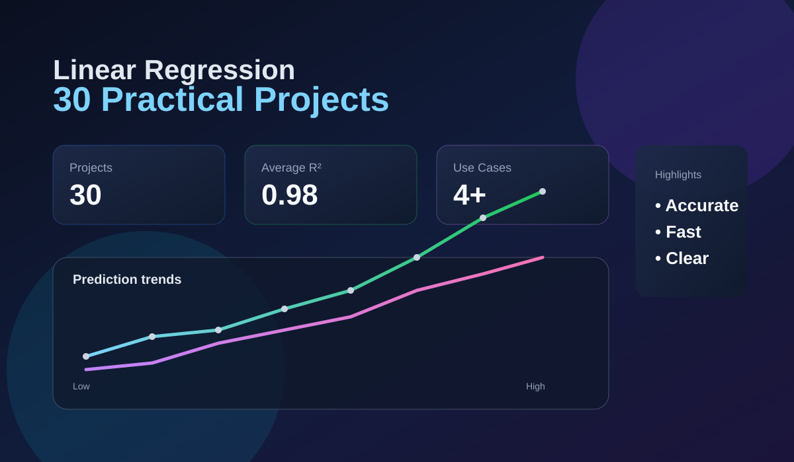

# Linear Regression 30 Practical Projects

<p align="center">
  
</p>

<p align="center">
  <a href="#project-overview"></a>
  <a href="#model-types"></a>
  <a href="#usage"></a>
  <a href="#screenshots"></a>
</p>

A hands-on machine learning portfolio that demonstrates how linear regression can be applied to real-world prediction problems using simple, interpretable models. This project walks through a complete ML workflow: creating a dataset, defining features and targets, train-test splitting, model training, evaluation, prediction, and visualization.

## Project Overview

This repository contains an end-to-end notebook that demonstrates multiple practical regression use-cases built around one core concept:

- Predict a continuous target value from input features
- Use linear relationships to estimate outcomes
- Evaluate model quality with MAE, RMSE, and R²
- Visualize actual vs predicted relationships
- Use the trained model to forecast new examples

Rather than treating regression as a theory-only topic, the notebook shows how the same algorithm can solve distinct business and academic problems such as:

- Housing price prediction
- Salary estimation
- Student performance prediction
- Electricity consumption forecasting
- Additional balanced, beginner-friendly regression scenarios across the 30-project collection

## Why This Project Matters

Linear regression remains one of the most important and practical machine learning algorithms because it is:

- Easy to understand
- Fast to train
- Highly interpretable
- Excellent for continuous numeric prediction
- Strong baseline model for more advanced algorithms

In this notebook, the model is intentionally transparent: you can inspect coefficients, evaluate error metrics, and understand which features influence predictions most strongly.

## Deep Analysis of the Project

### 1. Core workflow used across all examples

Each use-case follows a nearly identical pattern:

```python
X = df[["Feature_1", "Feature_2", "Feature_3"]]
y = df["Target"]

X_train, X_test, y_train, y_test = train_test_split(
    X, y, test_size=0.2, random_state=42
)

model = LinearRegression()
model.fit(X_train, y_train)

predictions = model.predict(X_test)
```

This pattern is effective because it teaches the fundamentals of supervised learning:

- Feature engineering: choosing meaningful inputs
- Target definition: what we want to predict
- Data split: training and unseen evaluation
- Model fitting: learning coefficients
- Validation: measuring generalization capability
- Inference: predicting new values

### 2. Interpretation of model metrics

The notebook evaluates each model with a standard set of metrics:

- MAE (Mean Absolute Error): average absolute difference between actual and predicted values
- RMSE (Root Mean Squared Error): penalizes large errors more strongly
- R² Score: proportion of variance explained by the model

Example results from the notebook:

| Use Case | MAE | RMSE | R² |
|---|---:|---:|---:|
| House Price | 5.09 | 6.84 | 0.98 |
| Salary | 0.33 | 0.37 | 1.00 |
| Student Marks | 1.32 | 1.72 | 0.99 |

These scores show that the simple linear model captures the underlying trends very well for these synthetic datasets.

### 3. The notebook teaches intuition, not just syntax

The project makes model behavior visible through:

- printed data tables
- coefficient output
- actual-vs-predicted scatter plots
- feature-vs-target relationship charts

This helps beginners connect math and code to practical understanding.

### 4. Strengths of linear regression in this portfolio

- Fast and reliable baseline model
- Easy to explain to non-technical audiences
- Great for identifying trend direction
- Useful for business dashboards and forecasting
- Works well when relationships are approximately linear

### 5. Limitations to keep in mind

Linear regression assumes a roughly linear relationship between features and target. In real-world environments, data may be:

- Nonlinear
- Influenced by hidden variables
- Noisy or incomplete
- Multicollinear

That is why this notebook is valuable as a learning foundation, not necessarily a final real-world deployment model.

## Featured Example: House Price Prediction

One of the clearest examples in the notebook models prices using features like:

- Area
- Bedrooms
- Bathrooms

The model predicts prices in lakhs and shows the relationship between home size and price. This is a realistic business scenario and an ideal introduction to multiple regression.

<p align="center">
  
</p>

## Featured Example: Salary Prediction

The salary use-case models income using:

- Experience
- Education
- Age

This demonstrates how a linear model can estimate wages, highlighting that some variables contribute more strongly than others.

<p align="center">
  
</p>

## Featured Example: Student Marks Prediction

The marks example shows how academic performance can be predicted from:

- Study hours
- Attendance
- Number of assignments submitted

This makes the model easy to understand because each feature has a direct intuitive connection to outcomes.

<p align="center">
  
</p>

## Repository Structure

```text
Linear-Regression-30-Practical-Projects/
├── Linear_Regression_30_Practical_Project.ipynb
├── README.md
├── assets/
│   ├── hero-dashboard.svg
│   ├── house-price.svg
│   ├── salary.svg
│   └── marks.svg
└── Sample
```

## Requirements

```bash
pip install pandas matplotlib scikit-learn notebook
```

## How to Run

1. Clone the repository:

```bash
git clone https://github.com/sgsinghashka-del/Linear-Regression-30-Practical-Projects.git
cd Linear-Regression-30-Practical-Projects
```

2. Open the notebook in Jupyter or VS Code:

```bash
jupyter notebook Linear_Regression_30_Practical_Project.ipynb
```

3. Execute the cells in order to:
   - load the dataset
   - train the regression model
   - evaluate outputs
   - view charts
   - predict new values

## Learning Outcomes

By working through this project, you will learn how to:

- prepare tabular data for regression
- split data into train and test sets
- train a linear regression model in scikit-learn
- interpret regression coefficients and intercepts
- evaluate model performance with standard metrics
- build prediction workflows for real-world problems
- present results with clear visualizations

## Screenshots

<p align="center">
  
</p>

<p align="center">
  
  
</p>

<p align="center">
  
</p>

## Final Thoughts

This project is a strong beginner-friendly introduction to supervised learning. It demonstrates not just how to train a model, but how to reason about it: feature selection, metric interpretation, model explainability, and practical forecasting.

For anyone learning data science or machine learning, this notebook acts as a clear roadmap from raw data to meaningful prediction.

---

This project is intended for educational and learning purposes.

