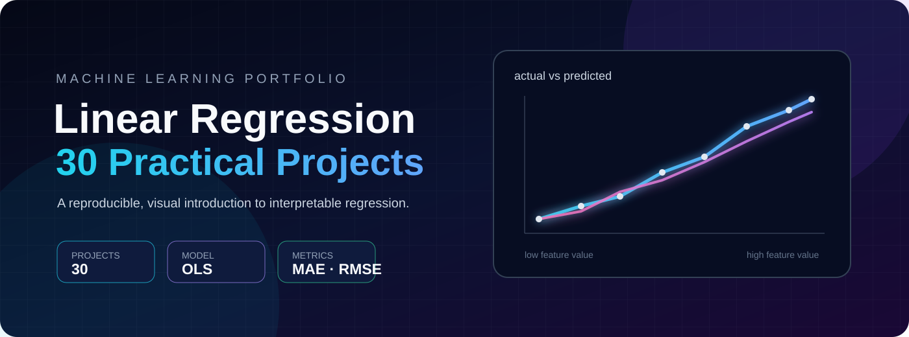
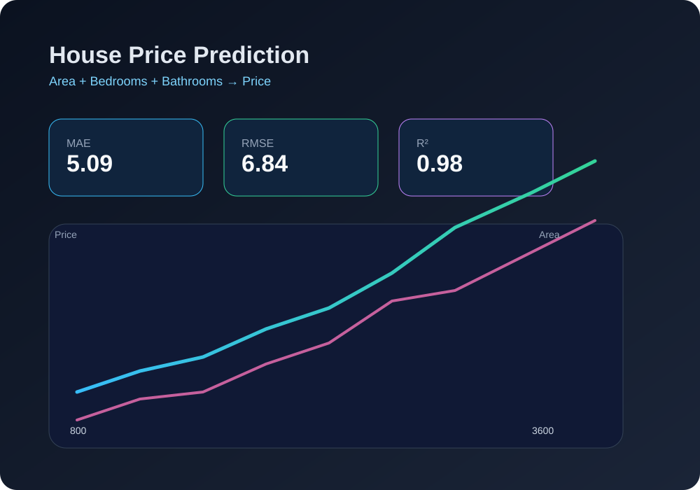
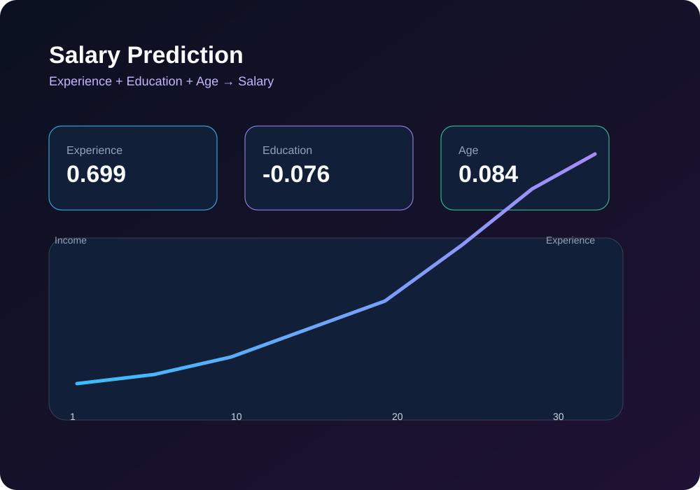
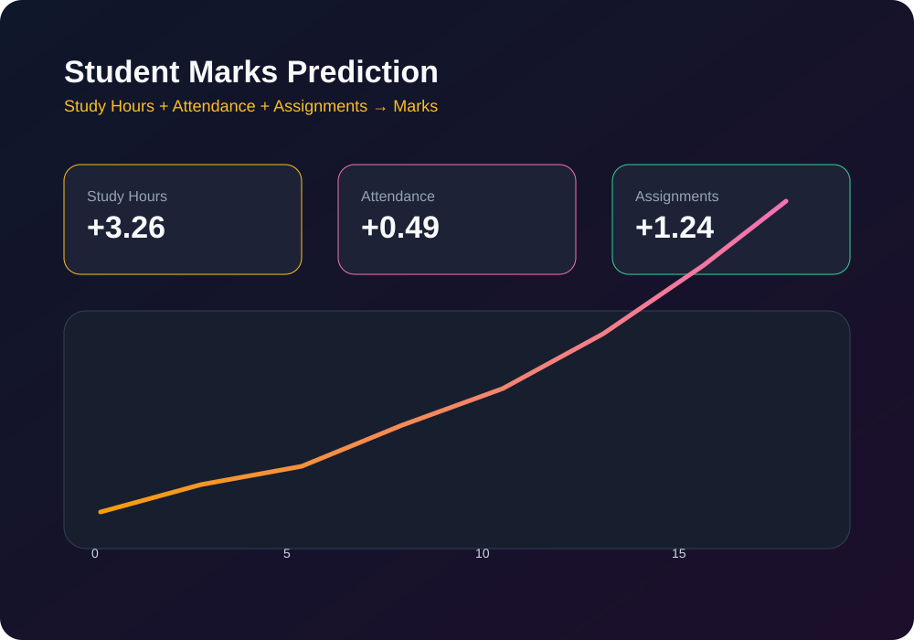

# Linear Regression 30 Practical Projects

<p align="center">
  <a href="https://colab.research.google.com/github/sgsinghashka-del/Linear-Regression-30-Practical-Projects/blob/main/Linear_Regression_30_Practical_Project.ipynb"></a>
  <a href="https://github.com/sgsinghashka-del/Linear-Regression-30-Practical-Projects/blob/main/Linear_Regression_30_Practical_Project.ipynb"></a>
  
  
  
</p>

<p align="center"></p>

<p align="center"><strong>A notebook-based empirical study of interpretable linear models across practical prediction scenarios.</strong></p>

## Abstract

This repository presents a compact experimental portfolio for understanding ordinary least-squares linear regression through repeated, practical applications. The accompanying notebook constructs small tabular datasets, selects explanatory variables, partitions observations into training and test subsets, estimates a multivariate linear model, evaluates predictive error, interprets coefficients, and produces diagnostic visualizations.

The project is designed as an educational research artifact: every transformation is visible, every prediction is reproducible, and the relationship between input variables and continuous outcomes can be inspected directly.

> **Scope note:** The notebook uses constructed, beginner-friendly datasets. Reported metrics demonstrate the workflow and behavior of the estimator; they should not be interpreted as evidence of performance on production or population-level data.

## Research Questions

1. Can a simple linear model capture the dominant trends in small, structured datasets?
2. How do feature coefficients communicate the direction and relative contribution of predictors?
3. How consistently do MAE, RMSE, and R² describe model quality across different target domains?
4. How can visual diagnostics make regression behavior easier to audit and explain?

## Experimental Design

The notebook applies the following pipeline to each use-case:

```text
Synthetic tabular data
        ↓
Feature/target definition (X, y)
        ↓
80/20 train-test split (random_state=42)
        ↓
Ordinary least-squares LinearRegression
        ↓
Predictions on held-out observations
        ↓
MAE · RMSE · R² · coefficient interpretation
        ↓
Plots and a new-example prediction
```

The fitted model takes the form:

\[
\hat{y} = \beta_0 + \beta_1x_1 + \beta_2x_2 + \cdots + \beta_px_p
\]

where \(\beta_0\) is the intercept and each \(\beta_i\) estimates the expected change in the target for a one-unit change in a predictor, conditional on the other predictors.

## Included Case Studies

| Case study | Predictors | Target | Example output |
|---|---|---|---|
| House price | Area, bedrooms, bathrooms | House price (₹ lakhs) | ₹112.95 lakhs for a 2,500 sq.ft, 4-bedroom, 3-bathroom house |
| Salary | Experience, education, age | Salary (₹ lakhs/year) | ₹7.93 lakhs/year for an 8-year experienced employee |
| Student marks | Study hours, attendance, assignments | Marks | Performance category plus predicted marks |
| Electricity consumption | Temperature, day, household size | Electricity units | Consumption estimate from household and environmental features |
| Additional notebook exercises | Domain-specific numeric features | Continuous outcomes | Repeated regression workflow |

## Reported Results

The visible notebook outputs report the following held-out test-set results for the featured examples:

| Case study | MAE | RMSE | R² |
|---|---:|---:|---:|
| House price | 5.09 | 6.84 | 0.98 |
| Salary | 0.33 | 0.37 | 1.00 |
| Student marks | 1.32 | 1.72 | 0.99 |

### Interpretation

- **House price:** an R² of 0.98 indicates that the selected features explain most of the variation in this constructed dataset; the typical absolute error is about 5.09 lakhs.
- **Salary:** the model follows the highly ordered synthetic salary trend closely, producing a very small RMSE of 0.37 lakhs.
- **Student marks:** the model captures the joint relationship between study behavior and marks, while the bounded prediction logic keeps the displayed score within 0–100.

Because the samples are small and deliberately structured, the results should be read as demonstrations of model mechanics rather than as generalization guarantees.

## Assumptions and Threats to Validity

Linear regression is most defensible when relationships are approximately linear, observations are appropriately independent, residual variance is reasonably stable, and predictors are not excessively collinear. This notebook does not establish all of those assumptions statistically. In particular:

- the datasets are manually created rather than collected from a representative population;
- the sample sizes are small;
- a single 80/20 split can produce unstable estimates;
- no confidence intervals, residual tests, cross-validation, or external validation are reported;
- high R² on synthetic data can overstate real-world predictive usefulness;
- coefficient magnitude should not be compared across features with different units without scaling or domain context.

These limitations are intentional discussion points for extending the work.

## Reproducibility

### Requirements

```bash
pip install pandas matplotlib scikit-learn notebook
```

### Run locally

```bash
git clone https://github.com/sgsinghashka-del/Linear-Regression-30-Practical-Projects.git
cd Linear-Regression-30-Practical-Projects
jupyter notebook Linear_Regression_30_Practical_Project.ipynb
```

Run the cells from top to bottom. The student-marks section includes interactive `input()` prompts; enter values within the ranges shown by the notebook.

### Run in Colab

[](https://colab.research.google.com/github/sgsinghashka-del/Linear-Regression-30-Practical-Projects/blob/main/Linear_Regression_30_Practical_Project.ipynb)

## Notebook Screenshot Gallery

The gallery below is paired with the saved notebook output. Select any panel to open the source notebook and inspect the executable code, printed metrics, and rendered Matplotlib output.

### Overview and model workflow

<p align="center"><a href="Linear_Regression_30_Practical_Project.ipynb"></a></p>

### House price: actual versus predicted and area trend

<p align="center"><a href="Linear_Regression_30_Practical_Project.ipynb"></a></p>

### Salary: coefficients and experience relationship

<p align="center"><a href="Linear_Regression_30_Practical_Project.ipynb"></a></p>

### Student marks: feature relationship and prediction behavior

<p align="center"><a href="Linear_Regression_30_Practical_Project.ipynb"></a></p>

> GitHub renders the notebook's original Matplotlib outputs on the linked notebook page. The gallery panels provide a consistent dark/neon visual index while the notebook remains the authoritative, executable source of the results.

## Recommended Extensions

- Replace constructed datasets with documented public datasets.
- Add repeated k-fold cross-validation and confidence intervals.
- Inspect residual plots and test linearity, normality, and homoscedasticity.
- Compare LinearRegression with Ridge, Lasso, Random Forest, and gradient boosting.
- Add preprocessing pipelines for missing values, outliers, and feature scaling.
- Export metrics to a results table and track experiments systematically.
- Convert the interactive prediction cells into a small Streamlit application.

## Repository Layout

```text
.
├── Linear_Regression_30_Practical_Project.ipynb
├── README.md
├── assets/
│   ├── neon-banner.svg
│   ├── hero-dashboard.svg
│   ├── house-price.svg
│   ├── salary.svg
│   └── marks.svg
└── Sample
```

## Citation and Educational Use

If you reuse this notebook for teaching or experimentation, please link back to this repository. The project is intended for education, portfolio demonstration, and reproducible experimentation—not financial, academic, employment, or utility decision-making.

---

<p align="center"><sub>Built with Python, pandas, scikit-learn, Matplotlib, and Jupyter.</sub></p>
